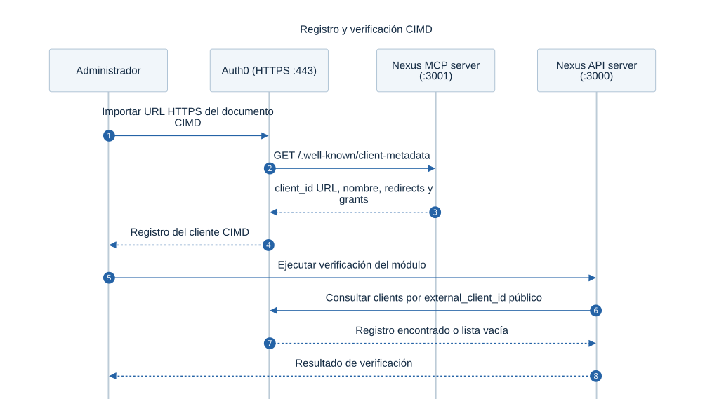
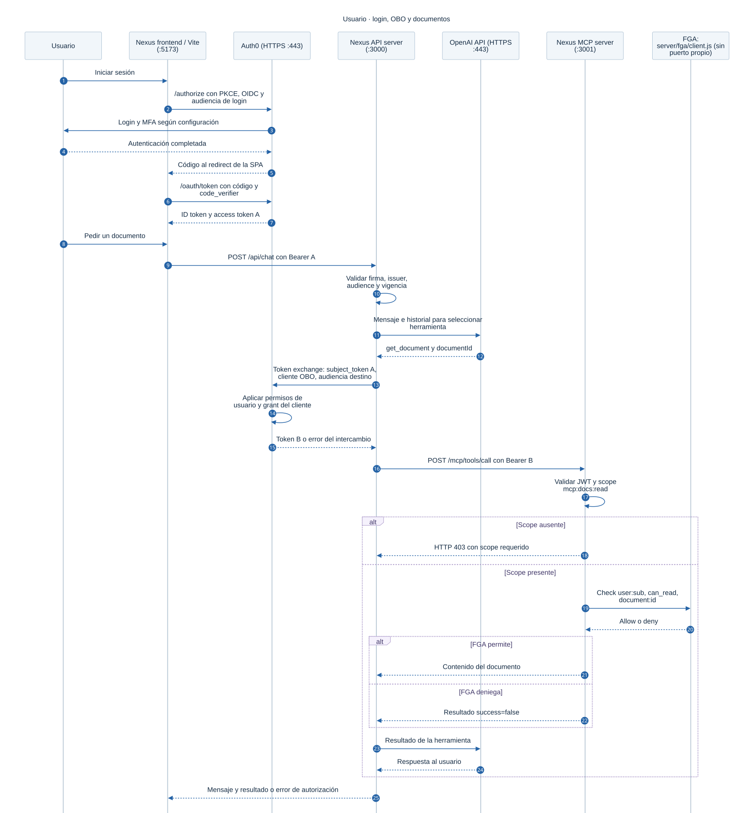
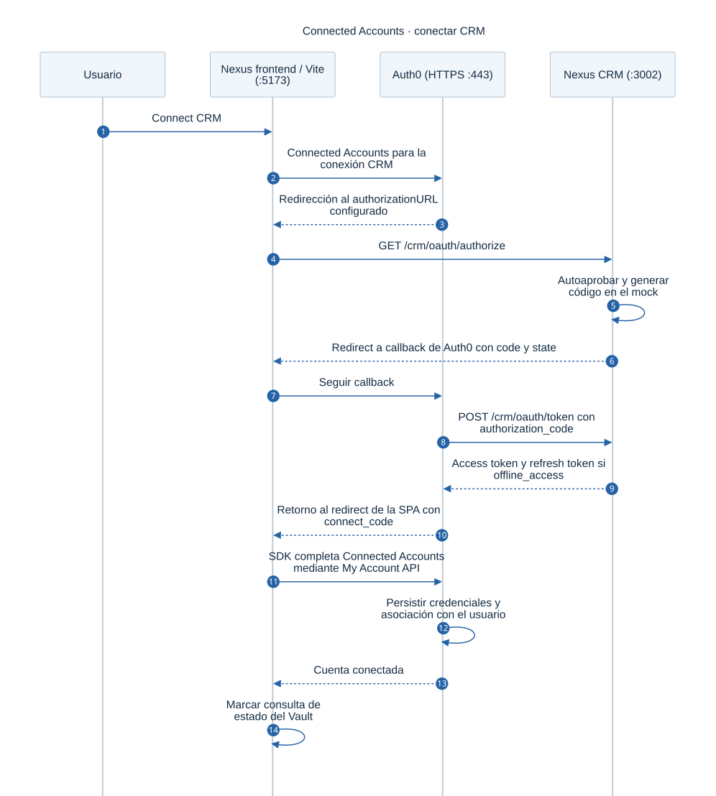
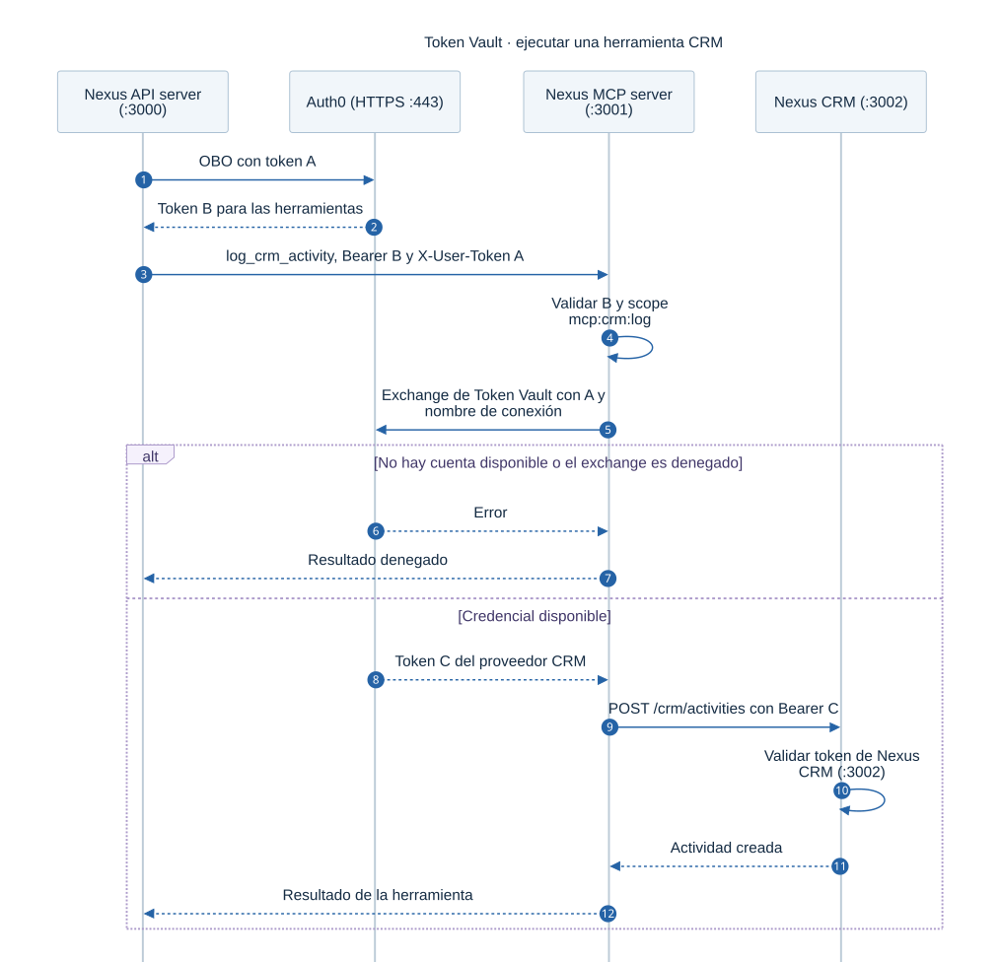
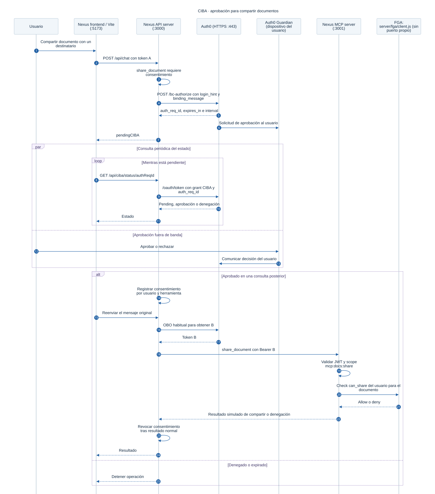
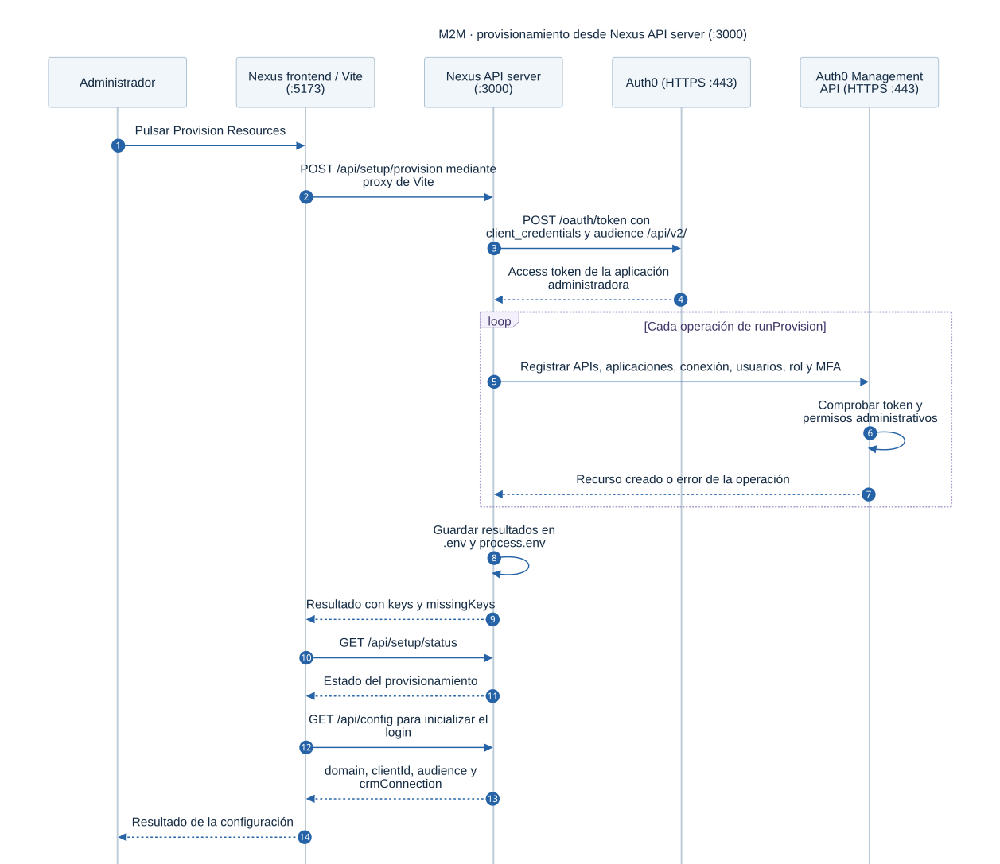
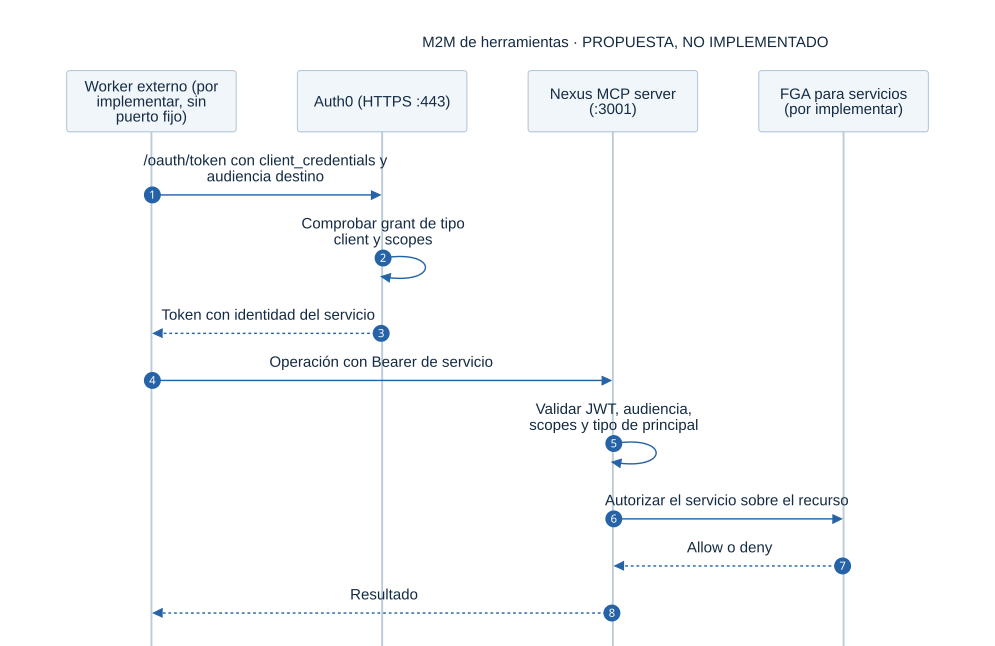

# Nexus: autenticación y autorización de extremo a extremo

Esta guía explica cómo una petición del usuario termina ejecutando una herramienta, qué identidad viaja en cada salto y dónde se decide si la operación está permitida. Está basada en el código de `demo-app/` revisado el **4 de octubre de 2026** y en las fuentes oficiales enlazadas al final.

**Nexus API server (:3000)** es el servidor Express de [server/index.js](server/index.js). Allí se atiende `/api/chat` y se ejecuta `processMessage()` de [server/llm.js](server/llm.js) o [server/simulator.js](server/simulator.js). La ejecución del agente forma parte de este servidor.

El recorrido principal es:

```text
Usuario → Nexus frontend (:5173) → Nexus API server (:3000)
                                      │
                                      └─ OBO → Nexus MCP server (:3001)
                                                  ├─ FGA → documentos
                                                  └─ Token Vault → Nexus CRM (:3002)
```

Para compartir documentos, Nexus API server (:3000) añade una aprobación CIBA antes de llamar a Nexus MCP server (:3001). El modelo propone herramientas; el código de los servicios ejecuta las comprobaciones y las operaciones.

Hay tres niveles que conviene distinguir: el protocolo estándar, la configuración de Auth0 y el comportamiento concreto de este laboratorio. Publicar metadata o solicitar un scope no concede por sí solo permiso para ejecutar una acción.

## Contenido

- [1. Conceptos básicos](#1-conceptos-básicos)
- [2. Arquitectura](#2-arquitectura)
- [3. Provisionamiento, clientes, audiencias y tokens](#3-provisionamiento-clientes-audiencias-y-tokens)
- [4. Descubrimiento y registro CIMD](#4-descubrimiento-y-registro-cimd)
- [5. Flujo con usuario: login, OBO y documentos](#5-flujo-con-usuario-login-obo-y-documentos)
- [6. CRM: conectar una cuenta y usar Token Vault](#6-crm-conectar-una-cuenta-y-usar-token-vault)
- [7. Compartir documentos con CIBA](#7-compartir-documentos-con-ciba)
- [8. Flujos machine to machine](#8-flujos-machine-to-machine)
- [9. Permisos del agente frente a permisos del usuario](#9-permisos-del-agente-frente-a-permisos-del-usuario)
- [10. Configuración local y ngrok](#10-configuración-local-y-ngrok)
- [11. Alcance y límites del laboratorio](#11-alcance-y-límites-del-laboratorio)
- [12. Mapa del código y referencias](#12-mapa-del-código-y-referencias)

## 1. Conceptos básicos

### Identidad, autorización y credenciales

| Concepto | Significado | Ejemplo en Nexus |
|---|---|---|
| Autenticación | Comprobar quién se presenta. | Auth0 autentica al usuario; Nexus API server (:3000) se autentica ante Auth0 con sus propias credenciales. |
| Autorización | Decidir qué puede hacer esa identidad sobre un recurso. | Scope para invocar `get_document` y FGA para leer `q3-roadmap`. |
| Principal | Identidad sobre la que se toma una decisión. | Un usuario humano o una aplicación de servicio. |
| Cliente OAuth | Aplicación que solicita tokens. No equivale al usuario. | La SPA y el cliente confidencial que hace OBO son clientes distintos. |
| Authorization Server, AS | Emite tokens después de aplicar sus políticas. | Auth0 para las APIs de Nexus; Nexus CRM (:3002), el mock del laboratorio, para su propia API. |
| Resource Server, RS | API que recibe y valida access tokens. | Nexus API server (:3000), Nexus MCP server (:3001) y Nexus CRM (:3002). |
| Scope | Capacidad solicitada o concedida, dentro de una API concreta. | `mcp:docs:read`. No identifica cuáles documentos puede leer el usuario. |
| Client grant | Autorización de una aplicación para una audiencia y un conjunto de scopes. | El grant con `subject_type: user` limita lo que Nexus API server (:3000) puede pedir por OBO. |
| Consentimiento | Aceptación del usuario cuando la política lo requiere. | Conectar Nexus CRM (:3002) o aprobar una operación mediante CIBA. No sustituye a los permisos. |

OAuth 2.0 organiza el acceso a recursos mediante tokens y grants. OIDC añade autenticación e información de identidad sobre OAuth. En el login se usan ambos: OIDC identifica al usuario y OAuth autoriza las llamadas a las APIs. [OAuth 2.0, RFC 6749](https://www.rfc-editor.org/rfc/rfc6749.html), [OIDC Core](https://openid.net/specs/openid-connect-core-1_0.html).

### Protocolos y mecanismos utilizados

| Sigla o mecanismo | Qué resuelve | Uso en este proyecto |
|---|---|---|
| Authorization Code + PKCE | Intercambia un código de login por tokens; PKCE vincula el intercambio a quien inició la solicitud. | Login de la SPA mediante el SDK de Auth0. [RFC 7636](https://www.rfc-editor.org/info/rfc7636/). |
| OBO, On-Behalf-Of | Un servicio llama a otro conservando el contexto del usuario. | Nexus API server (:3000) intercambia el token entrante para llamar a Nexus MCP server (:3001). |
| Token Exchange | Obtención de otro token a partir de uno existente, bajo la política del AS. Puede expresar delegación o impersonation. | OBO usa el grant de [RFC 8693](https://www.rfc-editor.org/rfc/rfc8693.html). |
| Client Credentials / M2M | Una aplicación obtiene acceso en su propia identidad, sin un usuario como sujeto. | Provisionamiento mediante Management API; no es el flujo del chat. |
| CIBA | Autenticación y consentimiento fuera del navegador donde se inició la solicitud. | Nexus API server (:3000) solicita aprobación; el usuario responde en Guardian y Nexus API server (:3000) consulta el resultado. [CIBA Core](https://openid.net/specs/openid-client-initiated-backchannel-authentication-core-1_0.html). |
| MCP | Protocolo para exponer capacidades a clientes de agentes. | El laboratorio usa rutas HTTP `/mcp/tools` y `/mcp/tools/call` para enseñar la frontera de autorización. |
| PRM | Protected Resource Metadata: describe el recurso protegido y sus servidores de autorización. | `/.well-known/oauth-protected-resource`. [RFC 9728](https://www.rfc-editor.org/rfc/rfc9728.html). |
| AS Metadata | Describe endpoints y capacidades del servidor de autorización. | Descubrimiento de `/authorize`, `/oauth/token` y JWKS. [RFC 8414](https://www.rfc-editor.org/rfc/rfc8414.html). |
| CIMD | Client ID Metadata Document: describe un cliente OAuth cuya identidad pública es una URL HTTPS. | `/.well-known/client-metadata`, importado en Auth0. [Borrador IETF](https://datatracker.ietf.org/doc/draft-ietf-oauth-client-id-metadata-document/). |
| Resource indicator | Identifica el recurso destinatario mediante el parámetro `resource`. | Concepto de [RFC 8707](https://www.rfc-editor.org/rfc/rfc8707.html); el intercambio actual utiliza `audience`, sin enviar `resource`. |
| RBAC | Permisos asignados mediante roles. | El rol `Nexus User` concede acceso al chat y capacidades de herramientas. |
| FGA / ReBAC | Autorización por objeto basada en relaciones. | Usuario editor de un documento o miembro de un departamento con acceso. [OpenFGA](https://openfga.dev/docs/learn/abac-vs-rebac). |
| Token Vault | Almacenamiento y obtención de credenciales federadas de proveedores externos. | Recuperar el access token de Nexus CRM (:3002) conectado al usuario. [Auth0 Token Vault](https://auth0.com/docs/secure/call-apis-on-users-behalf/token-vault). |
| Connected Accounts | Asocia una cuenta externa al perfil de un usuario en Auth0. | El botón “Connect CRM”, mediante My Account API. |
| MFA / Guardian | Segundo factor y dispositivo de autenticación. | MFA del login y aprobación CIBA son interacciones diferentes, aunque usen Guardian. |

### Tokens y claims

Un **access token** permite llamar a una API. Un **ID token** informa al cliente OIDC sobre el login; no se usa como bearer para las herramientas. Un **refresh token** sirve para obtener nuevos tokens sin repetir todo el login, sujeto a las políticas y a su vigencia. [OIDC Core](https://openid.net/specs/openid-connect-core-1_0.html), [OAuth 2.0](https://www.rfc-editor.org/rfc/rfc6749.html).

En Nexus los access tokens de las APIs de Auth0 se validan como JWT. JWT es un formato de claims: poder decodificarlo no implica que su firma sea válida. El middleware verifica el token; la lectura sin verificar de `iss` se usa para seleccionar la configuración del tenant. [JWT, RFC 7519](https://www.rfc-editor.org/info/rfc7519/).

| Claim | Qué indica | Qué no demuestra por sí solo |
|---|---|---|
| `iss` | Emisor del token. | Que la firma sea válida. |
| `sub` | Sujeto: usuario en OBO, identidad del servicio en M2M. | Permiso para una acción específica. |
| `aud` | Destinatario o destinatarios del token. | Una dirección que haya que abrir en el navegador. |
| `exp` | Fecha de expiración. | Revocación inmediata ante cualquier cambio de permisos. |
| `scope` | Capacidades concedidas al token. | Acceso a cada objeto de esa API. |
| `azp` / `client_id` | Cliente al que se atribuye la solicitud, según el perfil del token. | Identidad del humano que delegó. |
| `act` | Actor de la delegación; puede contener una cadena de actores. | Que el resource server esté comprobando una política adicional sobre ese actor. |
| `permissions` | Claim de permisos opcional en Auth0. | Que el servidor lo use: este MCP comprueba `scope`. |

Los bearer tokens se envían en `Authorization: Bearer …`. Quien posee un bearer puede presentarlo mientras resulte válido; el laboratorio no incorpora DPoP ni mTLS para vincularlo criptográficamente al emisor de la petición. [Bearer Tokens, RFC 6750](https://www.rfc-editor.org/info/rfc6750/).

## 2. Arquitectura

Los diagramas se muestran como imágenes, sin necesitar un visor de Mermaid. Todos los archivos y formatos editables están en el [catálogo de diagramas](diagrams/end-to-end/README.md). Las vistas de arquitectura también están disponibles en Draw.io y PDF.

Los puertos indicados son los valores por defecto; los scripts pueden seleccionar otros si están ocupados.

| Nombre usado en los diagramas | Puerto habitual | Dónde está implementado |
|---|---|---|
| Nexus frontend / Vite | `5173` en desarrollo | [src/App.jsx](src/App.jsx) y [vite.config.js](vite.config.js). |
| Nexus API server | `3000` | [server/index.js](server/index.js): `/api/chat`, configuración, CIBA y provisionamiento. |
| Nexus MCP server | `3001` | [server/mcp/server.js](server/mcp/server.js): metadata y ejecución de herramientas. |
| Nexus CRM | `3002` | [server/crm/app.js](server/crm/app.js): OAuth y `/crm/activities`. |
| Auth0 / Auth0 Management API / Token Vault | HTTPS `443`, servicio externo | Dominio `AUTH0_DOMAIN`; son capacidades del tenant Auth0. |
| OpenAI API | HTTPS `443`, servicio externo por defecto | [server/llm.js](server/llm.js); `OPENAI_BASE_URL` permite configurar otro endpoint. |
| FGA | Sin puerto propio en la simulación; endpoint configurado en el modo real | [server/fga/client.js](server/fga/client.js), con Okta FGA / OpenFGA cuando está configurado. |
| Auth0 Guardian | Dispositivo del usuario, sin servidor local de Nexus | Se comunica con Auth0 para MFA y CIBA. |

En el arranque habitual, `node server/index.js` abre los tres listeners Express de Nexus API server (`3000`), Nexus MCP server (`3001`) y Nexus CRM (`3002`) dentro del mismo proceso Node. Vite (`5173`) corre por separado. Los módulos `llm.js`, `ciba.js`, `vault.js` y `fga/client.js` no levantan otra API con un puerto propio. En `build` + `start`, Nexus API server (`3000`) también puede servir el frontend compilado.

[](diagrams/end-to-end/01-arquitectura.svg)

[SVG con zoom](diagrams/end-to-end/01-arquitectura.svg) · [PNG](diagrams/end-to-end/01-arquitectura.png) · [PDF](diagrams/end-to-end/01-arquitectura.pdf) · [Draw.io editable](diagrams/end-to-end/01-arquitectura.drawio) · [Mermaid](diagrams/end-to-end/01-arquitectura.mmd) · [PlantUML](diagrams/end-to-end/01-arquitectura.puml)

La SPA es una aplicación pública sin client secret. Nexus API server (:3000) conserva las credenciales confidenciales y coordina el agente. Nexus MCP server (:3001) valida el token B y aplica el scope y, para documentos, FGA. Nexus CRM (:3002) valida sus propios tokens C. Auth0 tiene funciones distintas en cada intercambio: emisor de tokens de Nexus y cliente OAuth frente al CRM.

OpenAI API (HTTPS :443, o el endpoint `OPENAI_BASE_URL`) recibe mensajes y resultados de herramientas en el camino real. El código no le pasa los tokens OAuth como parte del prompt. Nexus API server (:3000) sí maneja tokens y secretos: separar el modelo de las credenciales no elimina la necesidad de proteger el runtime.

## 3. Provisionamiento, clientes, audiencias y tokens

### Provisionamiento automático desde Nexus API server (:3000)

[](diagrams/end-to-end/09-configuracion-publica.svg)

[SVG con zoom](diagrams/end-to-end/09-configuracion-publica.svg) · [PNG](diagrams/end-to-end/09-configuracion-publica.png) · [PDF](diagrams/end-to-end/09-configuracion-publica.pdf) · [Draw.io editable](diagrams/end-to-end/09-configuracion-publica.drawio) · [Mermaid](diagrams/end-to-end/09-configuracion-publica.mmd) · [PlantUML](diagrams/end-to-end/09-configuracion-publica.puml)

**Nexus API server (`3000`) registra y configura recursos en Auth0 mediante Auth0 Management API (HTTPS `443`).** En el flujo local, el registro se inicia al pulsar **Provision Resources** en Nexus frontend / Vite (`5173`). Ese botón llama a `POST /api/setup/provision`; el proxy de Vite envía la petición a Nexus API server (`3000`). Levantar `node server/index.js` inicia los servidores, pero no ejecuta por sí solo el provisionamiento.

El recorrido del registro es:

1. Antes del provisionamiento, se configuran `AUTH0_DOMAIN`, `AUTH0_MGMT_CLIENT_ID` y `AUTH0_MGMT_CLIENT_SECRET` en `demo-app/.env`. El cliente administrativo debe existir en Auth0 y tener los permisos necesarios para Management API; esta es la configuración inicial que permite a Nexus crear los otros recursos.
2. [ProvisionPanel.jsx](src/components/ProvisionPanel.jsx) envía `POST /api/setup/provision`, incluyendo el origen del frontend como `appUrl`.
3. [server/index.js](server/index.js) llama a `getManagementToken()`. Nexus API server (`3000`) se autentica ante `https://{AUTH0_DOMAIN}/oauth/token` con `grant_type: client_credentials` y `audience: https://{AUTH0_DOMAIN}/api/v2/`.
4. [runProvision()](server/platform/provision.js) utiliza ese token administrativo para crear y configurar los recursos mediante llamadas a Auth0 Management API. Este paso es M2M administrativo: no utiliza el token de login de Alice o Bob.
5. `deploymentDataToEnvVars()` transforma los resultados en variables. Nexus API server (`3000`) las escribe en `demo-app/.env` y las incorpora a `process.env`; los resultados incluyen IDs de clientes, audiencias, nombre de conexión y referencias a los usuarios de demo.
6. Nexus frontend / Vite (`5173`) consulta `/api/setup/status` para comprobar el estado del provisionamiento y después obtiene `/api/config` para inicializar el login con los registros creados.

Estos son los recursos que el código intenta provisionar automáticamente desde la UI, donde `demoName` vale `codespace`:

| Recurso | Nombre real creado o configurado | Operación automática |
|---|---|---|
| API de herramientas | `Nexus Backend API` | Registrar `https://devcamp-docagent-api`, definir los cuatro scopes `mcp:*` y activar RBAC. |
| API de login/chat | `Nexus MCP Server` | Registrar `https://devcamp-mcp-server`, definir `chat:send` y activar RBAC. |
| Aplicación SPA | `docagent-spa-codespace` | Crear la aplicación, configurar callbacks, logout URLs y web origins para `appUrl`, y crear su grant hacia la API de login. |
| Aplicación CIBA | `docagent-ciba-codespace` | Crear el cliente con el grant CIBA y el canal `guardian-push`, y grants hacia las APIs de Nexus. |
| Conexión OAuth del CRM | `crm-codespace` | Crear la conexión con `authorizationURL` y `tokenURL` apuntando a Nexus CRM (`3002`), según el origen derivado. |
| Usuarios del laboratorio | `alice@docagent.demo`, `bob@docagent.demo` | Crear los perfiles de demo. |
| Rol de acceso | `Nexus User` | Crear el rol, añadir `chat:send` y los scopes de herramientas, y asignarlo a Alice y Bob. |
| Guardian y MFA | Factor `guardian-push`, política MFA y Action `enforce-guardian-push-codespace` | Configurar Guardian/MFA y crear, desplegar y asociar la Action al flujo post-login de la SPA. |
| Store y modelo FGA | Store/modelo de la instancia Nexus | Crear mediante la API de FGA, si se proporcionaron sus credenciales. Este recurso se gestiona en FGA y requiere configuración adicional a la de Auth0 Management API. |

Los servidores locales ya están ejecutándose en `3000`, `3001` y `3002`; registrar las APIs en Auth0 crea **identificadores, permisos y configuración de autorización**, no nuevos procesos ni nuevos puertos.

Hay pasos que el laboratorio deja para configurar manualmente:

| Paso | Qué queda a cargo de quien configura el laboratorio |
|---|---|
| Cliente administrativo inicial | Crear y autorizar el cliente de Management API y colocar sus credenciales en `.env`. |
| Cliente OBO | Crear `docagent-mcp-obo`, asociarlo a la audiencia entrante, habilitar OBO y conceder el acceso delegado a la API destino. `runProvision()` deja `m2m = null` y no crea este cliente. |
| Registro CIMD | Importar en Auth0 la URL pública de `/.well-known/client-metadata`; publicar el documento en Nexus MCP (`3001`) no ejecuta la importación. |
| Token Vault | Habilitar el almacenamiento/acceso de tokens federados de la conexión CRM; `createVaultConnection()` no lo activa en este provisionamiento. |
| Capacidades del tenant y usuario | Habilitar CIBA en el tenant cuando corresponda, completar enrolamiento Guardian y conectar la cuenta CRM del usuario mediante “Connect CRM”. |
| Ejecución local con ngrok | Ajustar `MCP_PUBLIC_URL` y los endpoints públicos de la conexión CRM en Auth0, según la sección 10. |

El helper `safe()` captura errores por operación y permite continuar con otras. Por eso un provisionamiento puede quedar parcial: revisa `missingKeys`, los logs `[provision]` y los verificadores de la UI antes de asumir que todos los recursos se crearon. El diagrama de la sección 8 muestra la secuencia de este registro administrativo.

### Los clientes de Auth0 tienen funciones distintas

| Registro | Función | Configuración o ubicación |
|---|---|---|
| `docagent-spa-${demoName}` (SPA de Nexus) | Login del humano, llamadas al chat y conexión de cuentas. | `VITE_AUTH0_CLIENT_ID`; se entrega en `/api/config`. |
| `docagent-mcp-obo` (nombre indicado en la guía del laboratorio) | Autenticar el servicio que intercambia tokens, mediante un Custom API Client confidencial. | `AUTH0_OBO_CLIENT_ID` y `AUTH0_OBO_CLIENT_SECRET`. |
| `Nexus Agent (DevCamp) Local` (nombre del CIMD en el código actual) | Identidad pública descrita mediante metadata. | `getClientMetadata()` y registro mediante su URL pública. |
| `docagent-ciba-${demoName}` | Iniciar la interacción de aprobación. | `AUTH0_CIBA_CLIENT_ID` y `AUTH0_CIBA_CLIENT_SECRET`. |
| Cliente de Management API | Crear y verificar recursos del tenant. | `AUTH0_MGMT_CLIENT_ID` y `AUTH0_MGMT_CLIENT_SECRET`. |

El provisionamiento desde la UI utiliza `demoName: "codespace"`, incluso si ejecutas la app localmente: crea `docagent-spa-codespace`, `docagent-ciba-codespace` y la conexión `crm-codespace`. Son nombres de registros en Auth0; sus IDs configurados son los que determinan qué registro se usa.

**El cliente CIMD y el cliente OBO son registros distintos en esta implementación.** `MCPClient.getToken()` envía el ID del cliente OBO, no la URL CIMD. El documento CIMD declara un cliente público con `authorization_code` y `token_endpoint_auth_method: none`; no crea el secreto usado por OBO.

En Auth0, el registro CIMD tiene un ID interno y un `external_client_id` correspondiente a la URL. El verificador del laboratorio consulta este último, aunque el texto de su error diga `client_id`. [Registro CIMD en Auth0](https://auth0.com/docs/api/management/v2/clients/post-clients-cimd-register).

### Las audiencias del código actual

La nomenclatura histórica puede confundir: la API de login se llama “Nexus MCP Server” en Auth0, pero el proceso HTTP de herramientas valida la audiencia llamada “Nexus Backend API”. El recorrido local actual se determina con estas variables:

| Token | Destino efectivo | Audiencia / configuración | Identidad |
|---|---|---|---|
| A: access token de login | Nexus API server (:3000). También se usa como subject token. | `AUTH0_AUDIENCE=https://devcamp-mcp-server` | Usuario; scope solicitado `chat:send`. |
| B: access token OBO | Nexus MCP server (:3001). | `AUTH0_TOOL_AUDIENCE=https://devcamp-docagent-api` | Usuario como `sub`, cliente que intercambia como actor. |
| C: access token de Nexus CRM (:3002) | Nexus CRM (:3002). | Emitido por Nexus CRM (:3002); el mock no implementa un `aud` de API. | Cuenta externa; Auth0 mantiene su asociación con el usuario. |
| Token de My Account API | Conectar y desconectar cuentas. | `https://{AUTH0_DOMAIN}/me/` | Usuario con scopes de Connected Accounts. |
| Token de Management API | Provisionar y verificar Auth0. | Management API del tenant. | Aplicación de administración. |

Una audiencia es un identificador lógico. `https://devcamp-docagent-api` no tiene que resolver a `localhost:3001`. Cambiar ngrok cambia la conectividad pública y la URL CIMD; no obliga a cambiar estas audiencias.

| Nombre de la API registrada en Auth0 | Audiencia | Servidor local que acepta ese token |
|---|---|---|
| Nexus MCP Server | `https://devcamp-mcp-server` | Nexus API server (`3000`), para el token A del chat. |
| Nexus Backend API | `https://devcamp-docagent-api` | Nexus MCP server (`3001`), para el token B de herramientas. |

## 4. Descubrimiento y registro CIMD

Hay dos preguntas diferentes:

1. **PRM: quién protege este recurso.** Publica la audiencia, los scopes y `authorization_servers`. Luego el cliente consulta la metadata del AS para saber cómo obtener tokens.
2. **CIMD: qué cliente solicita el acceso.** La URL pública devuelve su nombre, grant types y redirects. El AS puede obtener y validar ese documento.

Nexus MCP server (:3001) publica ambos documentos. Sin embargo, el cliente interno de Nexus obtiene su configuración de variables y del tenant: **no recorre PRM ni CIMD antes de cada llamada**. El registro CIMD se realiza durante la configuración y se comprueba con Management API.

[](diagrams/end-to-end/02-cimd.svg)

[SVG con zoom](diagrams/end-to-end/02-cimd.svg) · [PNG](diagrams/end-to-end/02-cimd.png) · [Mermaid](diagrams/end-to-end/02-cimd.mmd) · [PlantUML](diagrams/end-to-end/02-cimd.puml)

La URL importada debe coincidir exactamente con el `client_id` del documento. Por ejemplo, `http://localhost:3001/.well-known/client-metadata` y `https://mi-mcp.example/.well-known/client-metadata` son identidades distintas. La segunda además es accesible por Auth0.

Como referencia de interoperabilidad, la especificación MCP define descubrimiento PRM y metadata del AS. Publicar endpoints parecidos no garantiza implementar todo el protocolo; este laboratorio presenta un transporte HTTP simplificado. [Autorización MCP, versión 2025-11-25](https://modelcontextprotocol.io/specification/2025-11-25/basic/authorization).

## 5. Flujo con usuario: login, OBO y documentos

[](diagrams/end-to-end/03-usuario-obo-fga.svg)

[SVG con zoom](diagrams/end-to-end/03-usuario-obo-fga.svg) · [PNG](diagrams/end-to-end/03-usuario-obo-fga.png) · [Mermaid](diagrams/end-to-end/03-usuario-obo-fga.mmd) · [PlantUML](diagrams/end-to-end/03-usuario-obo-fga.puml)

El diagrama muestra el camino exitoso hasta obtener B; si Auth0 rechaza el intercambio, Nexus API server (:3000) responde con el error y no llama a Nexus MCP server (:3001). El camino con simulador sustituye la selección del modelo por reglas locales.

La solicitud OBO de [server/mcp/client.js](server/mcp/client.js) tiene esta forma; los valores son ilustrativos:

```json
{
  "grant_type": "urn:ietf:params:oauth:grant-type:token-exchange",
  "subject_token": "<access-token-A-del-usuario>",
  "subject_token_type": "urn:ietf:params:oauth:token-type:access_token",
  "requested_token_type": "urn:ietf:params:oauth:token-type:access_token",
  "audience": "https://devcamp-docagent-api",
  "scope": "mcp:docs:search mcp:docs:read mcp:crm:log mcp:docs:share",
  "client_id": "<id-del-cliente-OBO>",
  "client_secret": "<secreto-del-cliente-OBO>"
}
```

El código solicita los cuatro scopes juntos; no los reduce según la herramienta seleccionada. El token emitido puede tener menos scopes que los solicitados. Nexus MCP server (:3001) decide usando el `scope` del JWT validado, no la lista de la solicitud ni la del documento CIMD.

Auth0 OBO conserva `sub`, cambia la audiencia y añade información de delegación. El cliente debe estar asociado a la audiencia entrante mediante su `resource_server_identifier`, y autorizado para el destino mediante un grant de acceso delegado. En la configuración local descrita aquí, la audiencia entrante es `https://devcamp-mcp-server` y el destino es `https://devcamp-docagent-api`. [OBO en Auth0](https://auth0.com/docs/secure/call-apis-on-users-behalf/on-behalf-of-token-exchange).

Después de emitir B hay dos decisiones distintas:

- `mcp:docs:read` permite **invocar la capacidad** de lectura.
- FGA permite o deniega **leer ese documento** para `user:${sub}`.

`search_documents` filtra cada resultado con FGA; `get_document` comprueba `can_read` antes de devolver el contenido. El modelo FGA define `can_read = owner OR editor OR viewer` y `can_share = owner OR editor`.

### Dónde se comprueba FGA y dónde se configuran los permisos

**Nexus MCP server (`3001`) realiza la comprobación antes de devolver o compartir documentos.** El `sub` del token OBO identifica al usuario para esa decisión:

| Herramienta | Comprobación en `server/mcp/server.js` | Efecto |
|---|---|---|
| `search_documents` | `canReadDocument(userSub, doc.id, tenant)` para cada resultado. | Filtrar documentos que el usuario no puede leer. |
| `get_document` | `canReadDocument(userSub, documentId, tenant)`. | Denegar antes de devolver el contenido. |
| `share_document` | `canShareDocument(userSub, documentId, tenant)`. | Denegar si el usuario no es editor o propietario. |

La configuración tiene dos partes distintas:

1. **Reglas del modelo:** [server/fga/model.js](server/fga/model.js) describe los tipos `user`, `department` y `document`, las relaciones `owner`, `editor` y `viewer`, y los permisos derivados `can_read` y `can_share`. `FGA_AUTH_MODEL` es el modelo que se publica en el store cuando se provisiona FGA real. La simulación evalúa las reglas mediante `simCanRead()` y `simCanShare()` en [server/fga/client.js](server/fga/client.js); no interpreta dinámicamente `FGA_MODEL`.
2. **Asignaciones concretas:** `seedTuplesForUser()` en [server/fga/client.js](server/fga/client.js) crea las relaciones de demo mediante `writeTuple()`. Se llama desde el handler de herramientas de Nexus MCP server (`3001`), después de validar el scope y antes de ejecutar la lógica de la herramienta. No se asignan todos esos permisos FGA durante el registro inicial en Auth0.

Por ejemplo, estas asignaciones de demo permiten a Alice leer y compartir el roadmap:

```json
[
  { "user": "user:auth0|alice", "relation": "editor", "object": "document:q3-roadmap" },
  { "user": "user:auth0|alice", "relation": "member", "object": "department:engineering" }
]
```

El valor real de `user` utiliza el `sub` de Alice, no el texto literal `auth0|alice`. Todos los usuarios del demo reciben `viewer` para `handbook` y `security-policy`. Bob no recibe las relaciones de ingeniería; Alice y las demás identidades del camino de demo reciben las relaciones de miembro y editor. `compensation-q3` y `board-deck-q3` no reciben grants mediante este seeding.

Los permisos se almacenan según el modo:

| Modo | Dónde viven las asignaciones | Dónde se toma la decisión |
|---|---|---|
| Simulación local | Array `tupleStore` en memoria dentro de `server/fga/client.js`. | `simCanRead()` / `simCanShare()`, invocados por Nexus MCP server (`3001`). |
| FGA real | Tuples del store externo y su modelo de autorización. `writeTuple()` utiliza `live.write()`. | `liveCheck()` utiliza `client.check()` contra el servicio FGA configurado. |

`liveFgaForTenant()` selecciona el camino real cuando el tenant tiene store, URL, issuer, audience y credenciales FGA completos; de lo contrario utiliza la simulación. En la configuración local revisada para esta guía no se encontraron variables `FGA_*` configuradas en `.env`, por lo que ese camino utiliza memoria. Reiniciar el proceso elimina esos tuples simulados; el seeding vuelve a crearlos al usar herramientas.

Puedes inspeccionarlos en la pestaña **FGA Tuples** de Nexus frontend (`5173`) o con `GET http://localhost:3000/api/fga/tuples`. En simulación devuelve `live: false` y los tuples actuales; con FGA real devuelve `live: true` y no lista los tuples externos. Si todavía no se ejecutó una herramienta, las asignaciones de demo pueden no estar sembradas.

Los roles y scopes registrados en Auth0 autorizan capacidades como `mcp:docs:read`. Las relaciones FGA deciden qué documentos concretos puede leer ese usuario. Para cambiar acceso por documento en este demo, revisa `seedTuplesForUser()`; para cambiar la regla de lectura o compartir, revisa el modelo y las funciones de simulación correspondientes.

Los rechazos tampoco tienen todos el mismo formato: JWT inválido da HTTP 401; scope insuficiente da HTTP 403; FGA devuelve normalmente HTTP 200 con `success: false`. Un transporte exitoso no implica que la operación haya sido autorizada.

## 6. CRM: conectar una cuenta y usar Token Vault

### Primero: conectar la cuenta externa

“Connect CRM” llama a `connectAccountWithRedirect()` con el nombre de la conexión, `offline_access` y el redirect de la SPA. El SDK coordina el flujo con My Account API; si hace falta un token para esa audiencia o completar MFA, la UI hace un login interactivo y después retoma la conexión.

[](diagrams/end-to-end/04-conectar-crm.svg)

[SVG con zoom](diagrams/end-to-end/04-conectar-crm.svg) · [PNG](diagrams/end-to-end/04-conectar-crm.png) · [Mermaid](diagrams/end-to-end/04-conectar-crm.mmd) · [PlantUML](diagrams/end-to-end/04-conectar-crm.puml)

El `redirect_uri` que ves al visitar Nexus CRM (:3002) apunta al callback de **Auth0**, porque Auth0 es el cliente OAuth de Nexus CRM (:3002). Después Auth0 devuelve el navegador a la SPA. Son dos redirects distintos.

La conexión vive en Auth0 y contiene `authorizationURL` y `tokenURL`. Por eso “Connect CRM” puede ir a un Codespace antiguo aunque la SPA y Nexus API server (:3000) ya estén corriendo localmente. La documentación de [Connected Accounts](https://auth0.com/docs/secure/call-apis-on-users-behalf/token-vault/connected-accounts-for-token-vault) detalla la asociación de la cuenta externa al usuario.

### Después: ejecutar una herramienta que escribe en Nexus CRM (:3002)

[](diagrams/end-to-end/05-token-vault-crm.svg)

[SVG con zoom](diagrams/end-to-end/05-token-vault-crm.svg) · [PNG](diagrams/end-to-end/05-token-vault-crm.png) · [Mermaid](diagrams/end-to-end/05-token-vault-crm.mmd) · [PlantUML](diagrams/end-to-end/05-token-vault-crm.puml)

Son **dos intercambios diferentes**. OBO obtiene B para una API de Nexus. Token Vault obtiene C, emitido por el proveedor externo. El segundo usa el grant específico de Auth0:

```text
grant_type:
  urn:auth0:params:oauth:grant-type:token-exchange:federated-connection-access-token
requested_token_type:
  http://auth0.com/oauth/token-type/federated-connection-access-token
subject_token: token A
connection: nombre de la conexión CRM
```

El cliente MCP envía A en `X-User-Token` además del bearer B. El handler utiliza A como subject token del Vault; los comentarios del código explican que el camino que usaba el token OBO con `act` era rechazado. Esta es una decisión de la integración del laboratorio, no una propiedad universal de todo token exchange. [Access Token Exchange con Token Vault](https://auth0.com/docs/secure/call-apis-on-users-behalf/token-vault/access-token-exchange-with-token-vault).

Auth0 gestiona las credenciales federadas en el camino real. Nexus MCP server (:3001) recibe y cachea el access token del proveedor; el modelo no lo recibe. Los permisos finales de Nexus CRM (:3002) también dependen del proveedor: `mcp:crm:log` no concede automáticamente `crm:activities:write` en una cuenta externa.

El diagrama describe el camino real. Si falta configuración, algunas funciones del laboratorio pueden recurrir a simulación; un HTTP de rechazo explícito de Auth0 se trata como denegación. Los límites del mock y de los fallbacks se detallan en la sección 11.

## 7. Compartir documentos con CIBA

[](diagrams/end-to-end/06-ciba.svg)

[SVG con zoom](diagrams/end-to-end/06-ciba.svg) · [PNG](diagrams/end-to-end/06-ciba.png) · [Mermaid](diagrams/end-to-end/06-ciba.mmd) · [PlantUML](diagrams/end-to-end/06-ciba.puml)

El `binding_message` describe la operación en la notificación; el código lo sanitiza y limita a 64 caracteres. El cliente consulta `/oauth/token` usando `urn:openid:params:grant-type:ciba`. Se utiliza **poll mode**: que Guardian muestre un push no significa que los tokens se entreguen mediante el modo push del protocolo CIBA. [CIBA Core](https://openid.net/specs/openid-client-initiated-backchannel-authentication-core-1_0.html).

El token obtenido al completar CIBA marca el resultado como aprobado. El código registra consentimiento en memoria y vuelve a pasar por el OBO habitual; no utiliza directamente el access token CIBA para la herramienta.

**Aprobar no concede permisos que faltan.** Después de la aprobación siguen aplicando los scopes de B y `can_share` en FGA. Bob puede aprobar una solicitud y aun así recibir una denegación al intentar compartir un documento de ingeniería.

La comprobación CIBA reside en la orquestación del agente. Nexus MCP server (:3001) no comprueba el consentimiento ni recibe evidencia de aprobación vinculada a los argumentos. Por tanto, el diagrama describe el camino del chat; no debe interpretarse como una garantía CIBA para cualquier cliente que llame directamente a Nexus MCP server (:3001).

## 8. Flujos machine to machine

### M2M que sí existe: administración del tenant

[](diagrams/end-to-end/07-m2m-provisionamiento.svg)

[SVG con zoom](diagrams/end-to-end/07-m2m-provisionamiento.svg) · [PNG](diagrams/end-to-end/07-m2m-provisionamiento.png) · [Mermaid](diagrams/end-to-end/07-m2m-provisionamiento.mmd) · [PlantUML](diagrams/end-to-end/07-m2m-provisionamiento.puml)

Aquí no hay `subject_token` de un empleado. Management API autoriza al cliente administrativo según sus permisos. El SDK de FGA también usa credenciales de servicio cuando se configura el camino real: esas credenciales permiten consultar el motor, mientras que el `user` de cada check sigue siendo el usuario de la operación.

### M2M puro para herramientas: flujo de referencia, pendiente de implementar

[](diagrams/end-to-end/08-m2m-herramientas-propuesto.svg)

[SVG con zoom](diagrams/end-to-end/08-m2m-herramientas-propuesto.svg) · [PNG](diagrams/end-to-end/08-m2m-herramientas-propuesto.png) · [Mermaid](diagrams/end-to-end/08-m2m-herramientas-propuesto.mmd) · [PlantUML](diagrams/end-to-end/08-m2m-herramientas-propuesto.puml)

Este segundo diagrama es un diseño conceptual; el chat actual no implementa este flujo ni un modelo FGA para agentes como principales independientes. Una aplicación M2M no hereda permisos humanos. Se deben definir grants y relaciones para servicios y distinguirlos antes de ejecutar las herramientas.

No se debe probarlo suponiendo que el código actual rechazará todos los tokens de servicio: los handlers toman cualquier `sub` validado y el seeding de demo concede permisos de ingeniería a las identidades distintas de Bob. Hace falta una política explícita para separar usuario y servicio.

### Un agente sin navegador puede seguir trabajando por un usuario

Ejecutarse en un job no determina la identidad de autorización. Un trabajo con delegación humana válida sigue actuando por un usuario; `client_credentials` por sí solo representa a la aplicación. Si se necesita operar horas después, hay que diseñar vigencia, renovación, consentimiento y revocación: este `MCPClient` espera un access token A y no implementa un job que lo renueve.

Auth0 también documenta un [Privileged Worker Token Exchange para Token Vault](https://auth0.com/docs/secure/call-apis-on-users-behalf/token-vault/privileged-worker-token-exchange-with-token-vault). Es una capacidad adicional que requiere configuración y control de qué usuarios puede representar el worker; no está implementada en este repositorio.

## 9. Permisos del agente frente a permisos del usuario

### Token exchange y delegación no son sinónimos

RFC 8693 contempla delegación e impersonation. En delegación se distingue al sujeto del actor; en impersonation el receptor trata al actor como al sujeto dentro del contexto concedido. Por eso el nombre `token-exchange` no basta para concluir cómo se está actuando. [RFC 8693, sección 1.1](https://www.rfc-editor.org/rfc/rfc8693.html#section-1.1).

En el flujo OBO de Auth0 el usuario sigue en `sub` y el servicio aparece en `act` y en `azp` o `client_id`. Un ejemplo **ilustrativo**, que debe contrastarse con el JWT realmente emitido por tu tenant, sería:

```json
{
  "sub": "auth0|alice",
  "aud": "https://devcamp-docagent-api",
  "scope": "mcp:docs:read",
  "azp": "cliente-obo",
  "act": {
    "sub": "cliente-obo",
    "act": { "sub": "cliente-spa" }
  }
}
```

Conservar `sub` permite evaluar FGA para Alice. Conservar el actor permite atribuir la delegación al servicio. Los checks actuales de Nexus MCP server (:3001) usan `sub` y `scope`; no implementan una política propia basada en `act`. [Comportamiento OBO de Auth0](https://auth0.com/docs/secure/call-apis-on-users-behalf/on-behalf-of-token-exchange).

### Los permisos no se suman

Para un acceso delegado con RBAC y un grant de aplicación que limita scopes, puede representarse la emisión así:

```text
Scopes de B = scopes solicitados para la API destino
              ∩ scopes autorizados al cliente para acceso delegado
              ∩ permisos del usuario en la API destino
              ∩ consentimiento aplicable
```

Es un modelo de esa configuración, no una fórmula impuesta universalmente por RFC 8693. Auth0 permite políticas distintas y Actions que alteran el resultado; la autoridad efectiva es el token emitido y las comprobaciones de la API. [Client Grants de Auth0](https://auth0.com/docs/get-started/applications/application-access-to-apis-client-grants), [RBAC para APIs](https://auth0.com/docs/get-started/apis/enable-role-based-access-control-for-apis).

Los permisos propios del cliente en un grant `subject_type: client` **no se añaden** a OBO. El acceso delegado utiliza `subject_type: user`. Tener permiso M2M para compartir no autoriza a compartir por un empleado que no puede hacerlo. La política `Per-app authorization` permite usar el grant delegado como límite por aplicación. [API Access Policies](https://auth0.com/docs/get-started/apis/api-access-policies-for-applications).

Otra distinción: A tiene `chat:send` y B puede tener `mcp:docs:read`. Los scopes pertenecen a APIs diferentes; B no se calcula haciendo una intersección literal de los strings de `scope` de A y B. Auth0 evalúa los permisos del usuario y del cliente para **la audiencia de destino**.

### Ejemplos de permisos diferentes

La tabla supone solicitud explícita del scope, RBAC y grant delegado restrictivo. Si se permite emitir un token reducido, faltará el scope y Nexus MCP server (:3001) devolverá 403; si la política rechaza la solicitud, el flujo termina en el token endpoint.

| Permiso delegado del cliente | Permiso del usuario para la API destino | Permiso sobre el objeto | Resultado |
|---|---|---|---|
| Leer y compartir | Solo leer | Viewer del documento | Puede leer; compartir queda fuera de los permisos efectivos. |
| Solo leer | Leer y compartir | Editor del documento | El cliente limita el acceso: puede leer, no compartir. |
| Leer | Leer | Sin relación de lectura | Puede llegar a `get_document`, pero FGA deniega el documento. |
| Compartir | Compartir | Viewer, sin `can_share` | El scope permite la capacidad; FGA deniega compartir. |
| Compartir | Compartir | Editor; CIBA denegado | El camino del chat se detiene antes de la herramienta. |
| Compartir | Compartir | Editor; CIBA aprobado | El camino del chat puede completar la operación simulada. |
| Registrar en CRM | Registrar en CRM | Sin cuenta CRM conectada | La herramienta necesita una credencial externa disponible. |
| Solo permiso M2M para compartir | Usuario sin permiso de compartir | Cualquier relación | El grant M2M no amplía el acceso delegado del usuario. |

Para una acción concreta conviene expresar la decisión como condiciones acumulativas:

```text
permitir = token válido para este destino
           AND scope de la herramienta presente
           AND autorización por objeto, cuando aplica
           AND aprobación vigente, cuando aplica y se comprueba
           AND credencial y permisos del proveedor, cuando aplica
```

Esta expresión describe los controles necesarios. En el demo están distribuidos: scopes y FGA en MCP, CIBA en Nexus API server (:3000) y permisos externos en la integración con Nexus CRM (:3002). No todas las herramientas pasan por todos los controles.

### Cómo se ve con Alice y Bob

El provisionamiento asigna a ambos el rol `Nexus User`, incluyendo `chat:send` y los cuatro scopes de herramientas. La diferencia de acceso a documentos está en FGA:

| Documento | Alice | Bob |
|---|---|---|
| `handbook`, `security-policy` | Leer. | Leer. |
| `q3-roadmap`, `product-spec-v2` | Leer y compartir si pasa CIBA en el chat. | Sin acceso. |
| `compensation-q3`, `board-deck-q3` | Sin acceso mediante los tuples sembrados por el demo. | Sin acceso mediante los tuples sembrados por el demo. |

Así, que los dos tokens tengan `mcp:docs:read` no hace iguales sus permisos sobre documentos. CIBA tampoco transforma a Bob en editor.

### Cómo comprobarlo en tu tenant

1. Revisa el JWT A: `iss`, `sub`, `aud`, `scope` y vigencia.
2. Revisa que el cliente OBO esté asociado a la audiencia entrante y que tenga el grant **User-Delegated Access** para la API destino.
3. Revisa roles y permisos del usuario sobre esa API, RBAC y las Actions aplicables.
4. Obtén un B nuevo y examina `sub`, `aud`, `scope` y los claims del actor. Evita compartir tokens completos en logs o documentación.
5. Ejecuta una herramienta y consulta FGA para ese `sub` y ese documento; contrasta el resultado de negocio, no solo HTTP 200.

El cache OBO dura como máximo aproximadamente cinco minutos, con margen antes de expiración. Un cambio en grants puede no verse en la siguiente llamada si se reutiliza B. Vaciar el cache o reiniciar fuerza un intercambio nuevo para la comprobación; no significa que invalide tokens ya emitidos en otros procesos.

## 10. Configuración local y ngrok

### URLs públicas y privadas cumplen funciones diferentes

| Configuración | Ejemplo | Uso |
|---|---|---|
| Nexus frontend / Vite (:5173) | `http://localhost:5173` | Navegador y redirects de login. |
| Nexus API server (:3000) | `http://localhost:3000` | Destino del proxy `/api` de Vite. |
| Nexus MCP server (:3001), interno | `http://localhost:3001` | Llamadas de Nexus API server (:3000) a Nexus MCP server (:3001). |
| `MCP_PUBLIC_URL` | `https://mi-tunel-mcp.ngrok-free.app` | `client_id` canónico del documento y consulta del verificador CIMD. Usa el origen, sin `/.well-known/...`. |
| URL CIMD importada | `https://mi-tunel-mcp.ngrok-free.app/.well-known/client-metadata` | Identidad externa registrada en Auth0. |
| CRM público | `https://mi-tunel-crm.ngrok-free.app` | OAuth de Nexus CRM (:3002) accesible por Auth0. |
| `CRM_API_URL` | Opcional: `http://localhost:3002` | Endpoint de la API CRM llamado por MCP. Sin variable se usa localhost y `CRM_PORT`. |
| `VAULT_CONN_CRM` | Nombre de la conexión existente en Auth0. | Conexión que utiliza “Connect CRM” y el Vault. |

Se necesitan direcciones públicas distintas que enruten al MCP y al CRM, por ejemplo dos túneles o un proxy con rutas adecuadas. Exportar `:3001` no exporta automáticamente `:3002`.

Para tu conexión CRM existente, cambia en Auth0:

```text
authorizationURL = https://mi-tunel-crm.ngrok-free.app/crm/oauth/authorize
tokenURL         = https://mi-tunel-crm.ngrok-free.app/crm/oauth/token
```

La llamada al token endpoint viene de Auth0, por lo que `localhost:3002` no representa tu equipo desde allí. Nexus MCP server (:3001) puede seguir llamando a la API CRM por localhost: conectividad OAuth pública y conectividad interna del API son independientes.

Cambiar `CRM_API_URL` no actualiza la conexión OAuth guardada en Auth0. Además, el provisionamiento desde la UI deriva `crmUrl` de Codespaces o localhost: actualmente no lee una variable `CRM_PUBLIC_URL`. Si vuelves a crear recursos localmente, revisa las URLs OAuth resultantes.

Los redirects CIMD se derivan del host entrante sustituyendo el puerto MCP por `5173`. `MCP_PUBLIC_URL` fija la identidad CIMD, pero **no fija `redirect_uris`**: un hostname ngrok sin puerto no permite inferir el origen local de la SPA. Si usas el cliente CIMD para un login, configura sus redirects para ese flujo y verifica el documento. El chat actual hace login con el cliente SPA separado.

### Problemas frecuentes

| Síntoma | Causa probable | Qué revisar |
|---|---|---|
| Verificación CIMD busca localhost aunque ya importaste ngrok. | Se comparan identidades diferentes. | `MCP_PUBLIC_URL`, URL importada y `client_id` del documento. |
| “Connect CRM” abre un Codespace antiguo. | La conexión en Auth0 conserva esa URL. | `authorizationURL` y `tokenURL`; confirma `VAULT_CONN_CRM`. |
| Token exchange falla por audiencia. | Cliente OBO asociado a otra audiencia entrante o destino incorrecto. | A, `resource_server_identifier`, `AUTH0_TOOL_AUDIENCE`. |
| Herramienta da 403. | B no contiene el scope requerido. | Grant delegado, RBAC y `scope` realmente emitido. |
| Herramienta responde HTTP 200, pero no permite el documento. | Denegación FGA dentro del resultado. | `success`, `error` y relaciones para el `sub`. |
| CRM deniega el exchange. | Conexión o cliente sin configuración de API access, o cuenta no disponible. | Configuración Token Vault y Connected Accounts. |
| Un cambio de permisos no se refleja enseguida. | Token emitido y cache todavía vigentes. | B nuevo y caches de OBO/Vault. |
| Tras renovar ngrok falla CIMD o CRM. | Cambió una URL registrada externamente. | Identidad CIMD y endpoints OAuth guardados en Auth0. |

## 11. Alcance y límites del laboratorio

Estos puntos describen lo observado en el código; no son garantías de una implementación de producción.

| Área | Comportamiento actual y consecuencia |
|---|---|
| MCP y discovery | Transporte HTTP simplificado; el cliente interno usa configuración, no discovery automático. El intercambio no envía `resource` y la metadata usa campos del laboratorio. Se requiere revisión adicional para interoperar con un cliente MCP estándar. |
| CIBA en la frontera | Nexus API server (:3000) comprueba consentimiento; MCP solo comprueba JWT, scope y FGA. Una llamada directa a `share_document` con permisos no pasa por CIBA. |
| Vinculación de aprobación | Consentimiento guardado por usuario y nombre de herramienta, sin hash de argumentos ni caducidad propia. Se reenvía el mensaje y se vuelve a seleccionar la herramienta, en lugar de ejecutar una operación persistida e inmutable. Un resultado normal consume el consentimiento; una excepción antes de revocarlo puede dejarlo pendiente. |
| Usuario y servicio | No existe separación explícita de principales en herramientas/FGA. El seeding concede acceso de ingeniería a identidades distintas de Bob. No equivale a una política M2M segura. |
| `X-User-Token` | El handler MCP no valida por separado este token ni comprueba que su sujeto coincida con B antes de usarlo en Vault. La garantía del camino interno depende de que lo envíe correctamente Nexus API server (:3000) y de la validación de Auth0. |
| Scope del chat | La SPA pide `chat:send`, pero `/api/chat` valida JWT sin una comprobación explícita de ese scope. Pedirlo o asignarlo mediante un rol no equivale a imponerlo en esa ruta. |
| CRM mock | Autoaprueba OAuth; no valida el client secret, el redirect contra una allowlist ni el scope de escritura en `/crm/activities`. La atribución `userId` puede venir del body. Devuelve un refresh token con `offline_access`, pero el token endpoint solo soporta `authorization_code`, por lo que no demuestra renovación real. |
| FGA y Vault simulados | FGA puede usar memoria cuando falta configuración completa; el Vault puede usar credenciales simuladas cuando no hay camino real disponible. Una respuesta positiva del demo no demuestra que se haya usado un servicio externo. |
| Caches y revocación | OBO y credenciales CRM se cachean. Desconectar la cuenta no vacía explícitamente el cache de credenciales del Vault. No se puede afirmar que cualquier revocación tenga efecto inmediato en todos los saltos. |
| Compartir y registrar | `share_document` devuelve un registro simulado; no envía un documento a un destinatario real. `log_crm_activity` no comprueba FGA sobre el `documentId`: su control directo es el scope y la credencial CRM. |

Para endurecer este recorrido, la aprobación tendría que verificarse en el punto que ejecuta la acción, vinculada al usuario, actor, documento, destinatario y una operación concreta. También habría que separar políticas de usuario y servicio, eliminar autoasignaciones de demo y definir cómo se invalidan credenciales y consentimientos. Estas son implicaciones del código observado; no son cambios implementados por esta guía.

## 12. Mapa del código y referencias

### Dónde seguir cada paso

| Paso | Archivo |
|---|---|
| Configuración del login y callback | [src/auth/Auth0Provider.jsx](src/auth/Auth0Provider.jsx) |
| Petición del chat y polling de CIBA | [src/hooks/useChat.js](src/hooks/useChat.js) |
| “Connect CRM” | [src/components/VaultStatus.jsx](src/components/VaultStatus.jsx) |
| Configuración runtime, verificación y rutas API | [server/index.js](server/index.js) |
| Validación del token A | [server/middleware/auth.js](server/middleware/auth.js) |
| Validación JWT y lectura de claims | [server/platform/jwt.js](server/platform/jwt.js) |
| Selección de herramienta y consentimiento | [server/llm.js](server/llm.js), [server/simulator.js](server/simulator.js), [server/middleware/agent-auth.js](server/middleware/agent-auth.js) |
| Registro y llamada de herramientas | [server/tools/registry.js](server/tools/registry.js) |
| Intercambio OBO y transporte A/B | [server/mcp/client.js](server/mcp/client.js) |
| JWT B, scopes, FGA y ejecución | [server/mcp/server.js](server/mcp/server.js) |
| PRM y CIMD | [server/mcp/metadata.js](server/mcp/metadata.js), [server/mcp/cimd.js](server/mcp/cimd.js) |
| CIBA real y simulado | [server/middleware/ciba.js](server/middleware/ciba.js) |
| Exchange del token CRM y caches | [server/token-vault/vault.js](server/token-vault/vault.js) |
| Relaciones y decisiones FGA | [server/fga/model.js](server/fga/model.js), [server/fga/client.js](server/fga/client.js) |
| OAuth y Nexus CRM (:3002) mock | [server/crm/app.js](server/crm/app.js) |
| Roles, conexiones y audiencias provisionadas | [server/platform/provision.js](server/platform/provision.js) |
| Credenciales administrativas y client grants | [server/platform/auth0Management.js](server/platform/auth0Management.js) |
| Configuración local del tenant | [server/platform/tenant.js](server/platform/tenant.js) |

### Lectura adicional

| Para profundizar en… | Fuente oficial |
|---|---|
| OAuth y grants | [RFC 6749](https://www.rfc-editor.org/rfc/rfc6749.html) |
| Identidad OIDC | [OpenID Connect Core](https://openid.net/specs/openid-connect-core-1_0.html) |
| PKCE | [RFC 7636](https://www.rfc-editor.org/info/rfc7636/) |
| JWT y bearer tokens | [RFC 7519](https://www.rfc-editor.org/info/rfc7519/), [RFC 6750](https://www.rfc-editor.org/info/rfc6750/) |
| Delegación e impersonation | [RFC 8693, sección 1.1](https://www.rfc-editor.org/rfc/rfc8693.html#section-1.1) |
| Actor de delegación | [RFC 8693, sección 4.1](https://www.rfc-editor.org/rfc/rfc8693.html#section-4.1) |
| OBO y requisitos de Auth0 | [On-Behalf-Of Token Exchange](https://auth0.com/docs/secure/call-apis-on-users-behalf/on-behalf-of-token-exchange) |
| Límites por aplicación y permisos del usuario | [Client Grants](https://auth0.com/docs/get-started/applications/application-access-to-apis-client-grants), [API Access Policies](https://auth0.com/docs/get-started/apis/api-access-policies-for-applications), [RBAC](https://auth0.com/docs/get-started/apis/enable-role-based-access-control-for-apis) |
| Descubrimiento del recurso y del AS | [RFC 9728](https://www.rfc-editor.org/rfc/rfc9728.html), [RFC 8414](https://www.rfc-editor.org/rfc/rfc8414.html) |
| Destino del token | [RFC 8707](https://www.rfc-editor.org/rfc/rfc8707.html) |
| CIMD, que continúa siendo un borrador | [IETF: Client ID Metadata Document](https://datatracker.ietf.org/doc/draft-ietf-oauth-client-id-metadata-document/), [Registro en Auth0](https://auth0.com/docs/api/management/v2/clients/post-clients-cimd-register) |
| Autorización de un cliente MCP estándar | [Especificación MCP 2025-11-25](https://modelcontextprotocol.io/specification/2025-11-25/basic/authorization) |
| Aprobación mediante CIBA | [CIBA Core 1.0](https://openid.net/specs/openid-client-initiated-backchannel-authentication-core-1_0.html) |
| Cuentas conectadas y tokens externos | [Token Vault](https://auth0.com/docs/secure/call-apis-on-users-behalf/token-vault), [Connected Accounts](https://auth0.com/docs/secure/call-apis-on-users-behalf/token-vault/connected-accounts-for-token-vault), [Access Token Exchange](https://auth0.com/docs/secure/call-apis-on-users-behalf/token-vault/access-token-exchange-with-token-vault) |
| Jobs con acceso a credenciales de usuarios | [Privileged Worker Token Exchange](https://auth0.com/docs/secure/call-apis-on-users-behalf/token-vault/privileged-worker-token-exchange-with-token-vault) |
| Autorización por relaciones | [OpenFGA: ABAC y ReBAC](https://openfga.dev/docs/learn/abac-vs-rebac) |

Los diagramas son bloques Mermaid editables. GitHub los renderiza dentro del Markdown; otros lectores pueden necesitar soporte Mermaid. La guía explica el repositorio y la configuración local descrita, sin certificar que el tenant remoto tenga actualmente esos grants o políticas.
