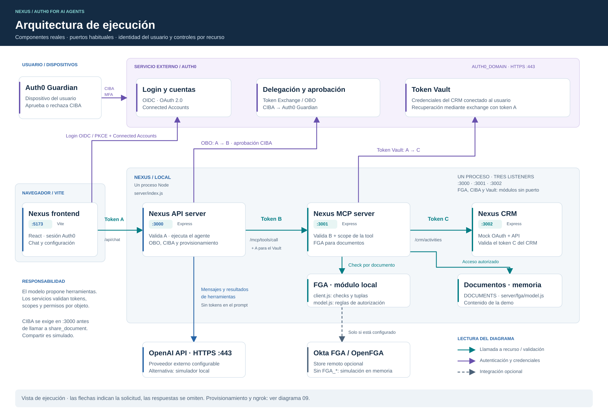
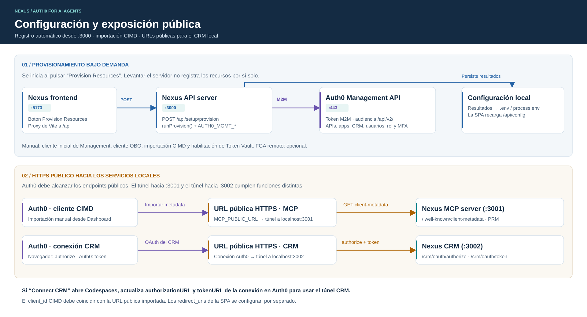

# Nexus: arquitectura y secuencias

Dos vistas de arquitectura y siete secuencias para la [guía de extremo a extremo](../../How-To-E2E.md). Los nombres, puertos y puntos de autorización corresponden al código de `demo-app/`, revisado el 4 de octubre de 2026.

## Arquitectura de ejecución

[](01-arquitectura.svg)

[Abrir SVG](01-arquitectura.svg) · [PNG](01-arquitectura.png) · [PDF](01-arquitectura.pdf) · [Draw.io editable](01-arquitectura.drawio) · [Mermaid](01-arquitectura.mmd) · [PlantUML](01-arquitectura.puml)

La vista distingue el navegador y Vite (`:5173`), el proceso Node que abre los tres listeners (`:3000`, `:3001`, `:3002`) y los servicios externos. El recorrido principal lleva el token A a Nexus API server, el token B a Nexus MCP server y el token C a Nexus CRM. Las flechas de arquitectura representan solicitudes; las respuestas se detallan en las secuencias.

La validación por documento se ejecuta desde **Nexus MCP server (:3001)**: `server/fga/client.js` implementa los checks y las tuplas simuladas; `server/fga/model.js` define las reglas y el corpus `DOCUMENTS`. El store remoto FGA es opcional. El modelo de lenguaje propone herramientas; el código de los servicios aplica la autorización.

## Configuración y exposición pública

[](09-configuracion-publica.svg)

[Abrir SVG](09-configuracion-publica.svg) · [PNG](09-configuracion-publica.png) · [PDF](09-configuracion-publica.pdf) · [Draw.io editable](09-configuracion-publica.drawio) · [Mermaid](09-configuracion-publica.mmd) · [PlantUML](09-configuracion-publica.puml)

**Provision Resources** invoca el provisionamiento en `:3000`, que usa Client Credentials y Auth0 Management API. El registro no se dispara únicamente por arrancar el servidor. El cliente OBO, la importación CIMD y la habilitación de Token Vault tienen pasos manuales. La vista también separa el túnel HTTPS hacia MCP (`:3001`) del túnel hacia CRM (`:3002`).

## Catálogo completo

| Diagrama | Imágenes | Fuentes editables | PDF |
|---|---|---|---|
| 01 · Arquitectura de ejecución | [SVG](01-arquitectura.svg) · [PNG](01-arquitectura.png) | [Draw.io](01-arquitectura.drawio) · [Mermaid](01-arquitectura.mmd) · [PlantUML](01-arquitectura.puml) | [PDF](01-arquitectura.pdf) |
| 02 · Registro y verificación CIMD | [SVG](02-cimd.svg) · [PNG](02-cimd.png) | [Mermaid](02-cimd.mmd) · [PlantUML](02-cimd.puml) | — |
| 03 · Usuario: login, OBO y FGA | [SVG](03-usuario-obo-fga.svg) · [PNG](03-usuario-obo-fga.png) | [Mermaid](03-usuario-obo-fga.mmd) · [PlantUML](03-usuario-obo-fga.puml) | — |
| 04 · Conectar CRM | [SVG](04-conectar-crm.svg) · [PNG](04-conectar-crm.png) | [Mermaid](04-conectar-crm.mmd) · [PlantUML](04-conectar-crm.puml) | — |
| 05 · Token Vault y herramientas CRM | [SVG](05-token-vault-crm.svg) · [PNG](05-token-vault-crm.png) | [Mermaid](05-token-vault-crm.mmd) · [PlantUML](05-token-vault-crm.puml) | — |
| 06 · Aprobación CIBA | [SVG](06-ciba.svg) · [PNG](06-ciba.png) | [Mermaid](06-ciba.mmd) · [PlantUML](06-ciba.puml) | — |
| 07 · M2M de provisionamiento | [SVG](07-m2m-provisionamiento.svg) · [PNG](07-m2m-provisionamiento.png) | [Mermaid](07-m2m-provisionamiento.mmd) · [PlantUML](07-m2m-provisionamiento.puml) | — |
| 08 · M2M de herramientas: **propuesto, no implementado** | [SVG](08-m2m-herramientas-propuesto.svg) · [PNG](08-m2m-herramientas-propuesto.png) | [Mermaid](08-m2m-herramientas-propuesto.mmd) · [PlantUML](08-m2m-herramientas-propuesto.puml) | — |
| 09 · Configuración y exposición pública | [SVG](09-configuracion-publica.svg) · [PNG](09-configuracion-publica.png) | [Draw.io](09-configuracion-publica.drawio) · [Mermaid](09-configuracion-publica.mmd) · [PlantUML](09-configuracion-publica.puml) | [PDF](09-configuracion-publica.pdf) |

El diagrama 08 describe una alternativa que requiere implementación y políticas para identidades de servicio. El flujo sin usuario implementado hoy es el de administración y provisionamiento del diagrama 07.

## Abrir, editar y exportar

- **SVG:** imagen vectorial para los README, navegador, zoom y presentaciones. No requiere un visor de Mermaid.
- **PNG:** alternativa para aplicaciones que no muestran SVG. Las exportaciones tienen fondo blanco y resolución de 1,5× respecto del SVG.
- **PDF:** arquitectura lista para compartir o imprimir, una página por vista.
- **Draw.io (`.drawio`):** abrir con diagrams.net / Draw.io, mediante **Archivo → Abrir desde → Dispositivo**. Los bloques, textos y conectores son objetos editables, no una captura incrustada. Estos archivos conservan la composición visual de las dos vistas de arquitectura.
- **Mermaid (`.mmd`):** fuentes de texto para un visor Mermaid, una extensión del editor o Mermaid CLI. Las secuencias incluyen numeración de mensajes, alternativas, loops y el paralelismo de CIBA.
- **PlantUML (`.puml`):** fuentes equivalentes para PlantUML. Las vistas de arquitectura usan Smetana y no requieren Graphviz externo. Las secuencias mantienen participantes, mensajes y ramas.

Las vistas de arquitectura en Mermaid y PlantUML contienen la misma topología y responsabilidades, con distribución automática propia de cada herramienta. Para mantener la composición visual del SVG y del PDF, editar el **Draw.io** correspondiente y volver a exportar. Las secuencias SVG/PNG se generaron desde **Mermaid**; si cambia un flujo, actualizar también su alternativa PlantUML.

Ejemplos de exportación con las herramientas ya instaladas, ejecutados desde esta carpeta:

```sh
# Secuencia Mermaid → SVG / PNG
mmdc -i 06-ciba.mmd -o 06-ciba.svg -b white
mmdc -i 06-ciba.mmd -o 06-ciba.png -b white -s 1.5

# Validar PlantUML sin modificar las imágenes existentes
java -jar /ruta/plantuml.jar -charset UTF-8 -checkonly "*.puml"

# Exportar una versión PlantUML sin sobrescribir el SVG generado por Mermaid
java -jar /ruta/plantuml.jar -charset UTF-8 -tsvg -o plantuml-export 06-ciba.puml
```

Para esta entrega se validaron las nueve fuentes con Mermaid 11.4.1 y PlantUML 1.2025.2, se comprobaron los XML de Draw.io/SVG y se revisaron visualmente las dos vistas de arquitectura y las secuencias principales.
